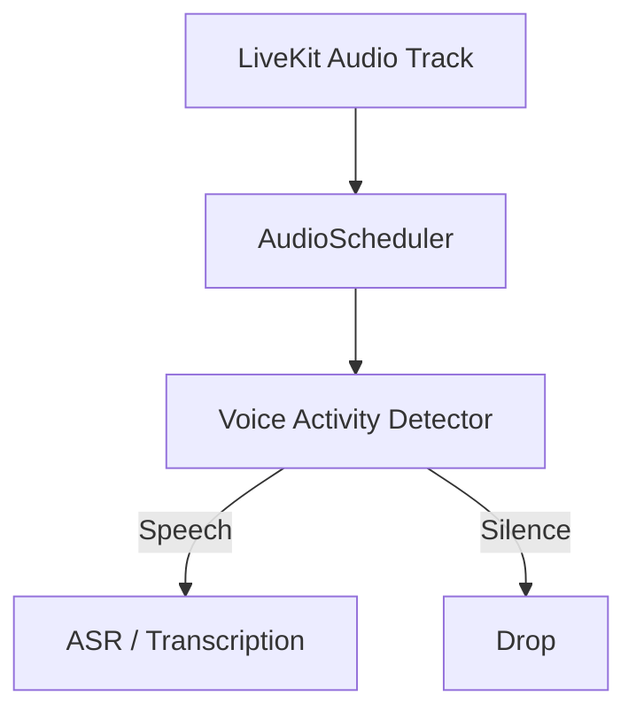

# Audio Runtime (V1.6)

Velo's Audio Runtime is designed to operate in parallel with the video pipeline, providing synchronized, independent scheduling of audio ingestion and processing.

> [!WARNING]
> Native LiveKit audio ingestion via `_velo_native` is currently **UNIMPLEMENTED**. The native C++/Rust extension only extracts video tracks. The Python `audio` module currently provides abstractions and mock infrastructure to prepare for future multimodal capabilities.

## Architecture

The audio architecture mirrors the principles of the video architecture (bounded memory, dropping old data under backpressure), but operates on `AudioChunk` structures instead of video frames.

## `AudioChunk`
The core representation. Immutable tensor holding:
- `samples`: PyTorch tensor (e.g., float32 [-1.0, 1.0])
- `sample_rate`: e.g. 16000
- `channels`: e.g. 1
- `timestamp`: start timestamp
- `duration`: chunk duration in seconds

## `AudioScheduler`
A synchronized scheduler that groups variably sized incoming audio chunks into consistently sized chunks (e.g., 500ms) for VAD and ASR processing.
- Uses `max_buffered_s` to enforce bounded memory and backpressure.
- Drops oldest audio chunks when the buffer overflows.

## `VAD` (Voice Activity Detection)
A heuristic Root Mean Square (RMS) energy-based detector.
- Extremely cheap and deterministic.
- Does not use neural networks.
- Bypasses ASR if silence is detected.

## `ASRAdapter`
Abstract interface for Automatic Speech Recognition.
- Currently implemented via `MockASRAdapter` for integration testing.
- Yields a `Transcript` containing the recognized text and timing information.
